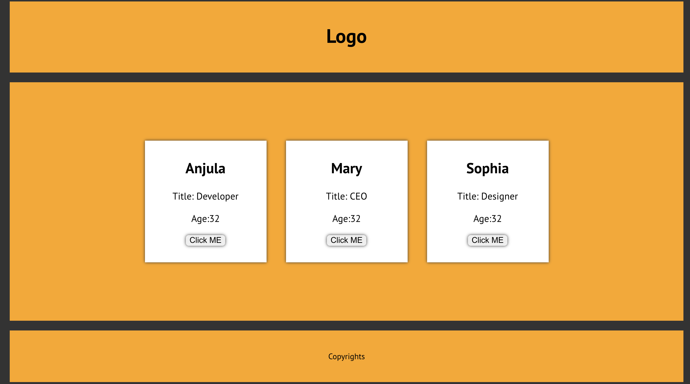

## Boxes App

This is the project created using react application to learn class component.
Used Es6 class component and state to render multiple person information by making person card.

## Technologies used

Built with:

- HTML
- CSS
- JS
- Reactjs

## Screenshot

## Sources

- [reactjs documentation](https://reactjs.org/tutorial/tutorial.html)

## Authors and acknowledgment

Anjula Timsina

- [GitHub](https://github.com/meanjula)
- [linkedIn](https://www.linkedin.com/in/meanjula/)
